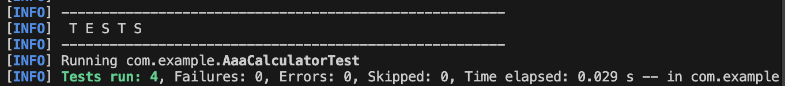

# Exercise 4: Arrange-Act-Assert (AAA) Pattern, Test Fixtures, Setup and Teardown Methods in JUnit

This folder contains a self-contained Maven + JUnit 4 project demonstrating:
- The **Arrange-Act-Assert (AAA)** pattern for writing clear, readable tests.
- Test fixtures for setting up and tearing down the test environment.

---

## Core Concepts Explained

### 1. Arrange-Act-Assert (AAA) Pattern
The AAA pattern is a standard structure used to write clean and organized unit tests. It divides a test case into three distinct sections:
- **Arrange:** Set up the test conditions, initialize variables, mock dependencies, and prepare any inputs.
- **Act:** Execute the target method or operation that is being tested.
- **Assert:** Verify that the output or side effects of the target method match the expected behavior.

#### Example from AaaCalculatorTest:
```java
@Test
public void add_whenOperandsArePositive_returnsSum() {
    // 1. Arrange
    int a = 20;
    int b = 22;

    // 2. Act
    int result = calculator.add(a, b);

    // 3. Assert
    assertNotNull(calculator);
    assertEquals(42, result);
    assertTrue(result > 0);
}
```

### 2. Setup (`@Before`) and Teardown (`@After`)
- **`@Before setUp()`**: Prepares the test state (like instantiating the calculator instance) before each test execution.
- **`@After tearDown()`**: Resets/cleans up the state (setting the calculator instance to `null`) after each test execution to ensure no test state leaks into other tests.

---

## Code Reference

### AaaCalculatorTest.java (`src/test/java/com/example/AaaCalculatorTest.java`)
This test class includes an embedded, simple static inner `Calculator` class to demonstrate the pattern.
```java
package com.example;

import static org.junit.Assert.assertEquals;
import static org.junit.Assert.assertNotNull;
import static org.junit.Assert.assertNull;
import static org.junit.Assert.assertTrue;

import org.junit.After;
import org.junit.Before;
import org.junit.Test;

public class AaaCalculatorTest {

    private Calculator calculator;

    @Before
    public void setUp() {
        calculator = new Calculator(); // Arrange setup
    }

    @After
    public void tearDown() {
        calculator = null; // Teardown cleanup
    }

    @Test
    public void add_whenOperandsArePositive_returnsSum() {
        // Arrange
        int a = 20;
        int b = 22;

        // Act
        int result = calculator.add(a, b);

        // Assert
        assertNotNull(calculator);
        assertEquals(42, result);
        assertTrue(result > 0);
    }

    @Test
    public void subtract_whenSecondIsLarger_returnsNegative() {
        // Arrange
        int a = 10;
        int b = 25;

        // Act
        int result = calculator.subtract(a, b);

        // Assert
        assertEquals(-15, result);
        assertTrue(result < 0);
    }

    @Test
    public void calculateAverage_whenListHasValues_returnsExpectedAverage() {
        // Arrange
        int[] values = new int[] { 2, 4, 6, 8 };

        // Act
        Double average = calculator.average(values);

        // Assert
        assertNotNull(average);
        assertEquals(5.0, average.doubleValue(), 0.0001);
    }

    @Test
    public void calculateAverage_whenListIsNull_returnsNull() {
        // Arrange
        int[] values = null;

        // Act
        Double average = calculator.average(values);

        // Assert
        assertNull(average);
    }

    // Target Class under test
    private static class Calculator {
        int add(int a, int b) { return a + b; }
        int subtract(int a, int b) { return a - b; }
        Double average(int[] values) {
            if (values == null || values.length == 0) {
                return null;
            }
            int sum = 0;
            for (int v : values) {
                sum += v;
            }
            return sum / (double) values.length;
        }
    }
}
```

---

## How to Run

### Command
From this folder:
```bash
python run.py
```
or:
```bash
mvn test
```

---

## Expected Test Output

```text
-------------------------------------------------------
 T E S T S
-------------------------------------------------------
Running com.example.AaaCalculatorTest
Tests run: 4, Failures: 0, Errors: 0, Skipped: 0, Time elapsed: 0.026 s -- in com.example.AaaCalculatorTest

Results:

Tests run: 4, Failures: 0, Errors: 0, Skipped: 0
```

---

## Execution Screenshot
Below is the output screenshot showing the successful AAA pattern test execution on the terminal:



---
**Author:** Shivam Patil  
**Deep Skilling Program**
