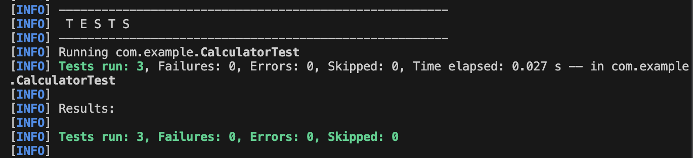

# JUnit Basic Testing (JUnit 4)

This project demonstrates basic unit testing using **JUnit 4** with a simple `Calculator` class. It is structured to help students understand the fundamentals of unit testing, setup and teardown fixtures, and basic assertions in Java.

---

## Project Structure

```text
JUnit_BasicTesting/
├── pom.xml
├── run.py
├── README.md
└── src/
    ├── main/java/com/example/Calculator.java
    └── test/java/com/example/CalculatorTest.java
```

---

## Core Concepts Explained

### 1. Test Fixtures (`@Before` and `@After`)
- **`@Before` (`setUp` method):** Runs before *every* individual test case. Used to initialize common resources (like creating a new instance of `Calculator`) so each test starts with a fresh state.
- **`@After` (`tearDown` method):** Runs after *every* individual test case. Used to clean up resources (like setting the calculator reference to `null`) to prevent memory leaks and state pollution.

### 2. Assertions used:
- `assertEquals(expected, actual)`: Verifies that the expected value matches the actual value returned by the method.
- `assertTrue(condition)`: Assures that the specified condition is `true`.
- `assertFalse(condition)`: Assures that the specified condition is `false`.
- `assertNull(object)`: Assures that the object reference is `null`.
- `assertNotNull(object)`: Assures that the object reference is not `null`.

---

## Code Reference

### Calculator.java (`src/main/java/com/example/Calculator.java`)
Provides basic arithmetic operations:
```java
package com.example;

public class Calculator {
    public int add(int a, int b) { return a + b; }
    public int subtract(int a, int b) { return a - b; }
    public int multiply(int a, int b) { return a * b; }
    public double divide(int a, int b) {
        if (b == 0) throw new IllegalArgumentException("Cannot divide by zero");
        return (double) a / b;
    }
}
```

### CalculatorTest.java (`src/test/java/com/example/CalculatorTest.java`)
Implements the test suite using JUnit 4 annotations:
```java
package com.example;

import static org.junit.Assert.*;
import org.junit.After;
import org.junit.Before;
import org.junit.Test;

public class CalculatorTest {
    private Calculator calculator;

    @Before
    public void setUp() {
        calculator = new Calculator(); // Initialize before each test
    }

    @After
    public void tearDown() {
        calculator = null; // Clean up after each test
    }

    @Test
    public void testAdd() {
        assertEquals(15, calculator.add(10, 5));
    }

    @Test
    public void testSubtract() {
        assertEquals(5, calculator.subtract(10, 5));
    }

    @Test
    public void testAssertions() {
        assertEquals(50, calculator.multiply(10, 5));
        assertTrue(calculator.add(5, 5) > 0);
        assertFalse(calculator.subtract(5, 5) > 0);
        assertNull(null);
        assertNotNull(calculator);
    }
}
```

---

## How to Run

### Command
Execute the following python script from this folder:
```bash
python run.py
```
This runs the underlying Maven clean and test command:
```bash
mvn clean test
```

---

## Expected Test Output

```text
-------------------------------------------------------
 T E S T S
-------------------------------------------------------
Running com.example.CalculatorTest
Tests run: 3, Failures: 0, Errors: 0, Skipped: 0, Time elapsed: 0.052 s -- in com.example.CalculatorTest

Results:

Tests run: 3, Failures: 0, Errors: 0, Skipped: 0
```

---

## Execution Screenshot
Below is the output screenshot showing the successful test execution on the terminal:



---
**Author:** Shivam Patil  
**Deep Skilling Program**
