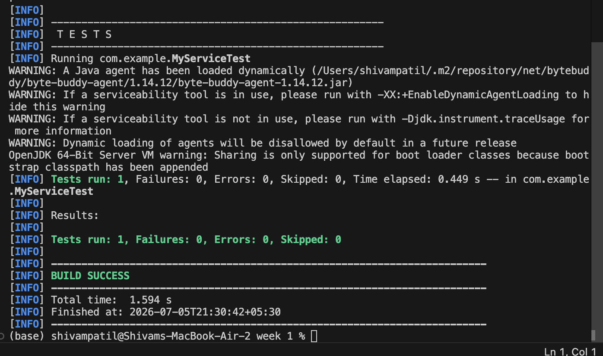

# JUnit Mocking and Stubbing Exercise (JUnit 5 + Mockito)

This project demonstrates how to perform **Mocking and Stubbing** using **Mockito** and **JUnit 5 (JUnit Jupiter)** in a Maven environment. It is designed to help students learn how to isolate a unit of code by mocking its external dependencies.

---

## Core Concepts Explained

### 1. Mocking
In unit testing, we want to test a class (e.g., `MyService`) in isolation. If the class depends on an external API, database, or network service (e.g., `ExternalApi`), we do not want to make real API or database calls because they are slow, unreliable, and outside our control.
**Mocking** is the process of creating a simulated (or fake) object that mimics the behavior of the real dependency.

### 2. Stubbing
**Stubbing** is the process of defining exactly what a mock object should return when its methods are called. 
Using Mockito's `when(...).thenReturn(...)` syntax, we tell the mock interface how to respond during the test execution.

---

## Code Reference

### ExternalApi.java (`src/main/java/com/example/ExternalApi.java`)
The interface representing the external service dependency:
```java
package com.example;

public interface ExternalApi {
    String getData();
}
```

### MyService.java (`src/main/java/com/example/MyService.java`)
The class under test, which accepts `ExternalApi` via constructor injection (Loose Coupling):
```java
package com.example;

public class MyService {
    private final ExternalApi externalApi;

    public MyService(ExternalApi externalApi) {
        this.externalApi = externalApi;
    }

    public String fetchData() {
        return externalApi.getData(); // delegates call to the external api dependency
    }
}
```

### MyServiceTest.java (`src/test/java/com/example/MyServiceTest.java`)
The JUnit 5 test class demonstrating mocking and stubbing:
```java
package com.example;

import static org.junit.jupiter.api.Assertions.assertEquals;
import static org.mockito.Mockito.*;

import org.junit.jupiter.api.Test;
import org.mockito.Mockito;

public class MyServiceTest {
    @Test
    public void testExternalApi() {
        // 1. Create a mock object for the external API
        ExternalApi mockApi = Mockito.mock(ExternalApi.class);

        // 2. Stub the method to return a predefined value ("Mock Data")
        when(mockApi.getData()).thenReturn("Mock Data");

        // 3. Inject the mock into the service
        MyService service = new MyService(mockApi);

        // 4. Act
        String result = service.fetchData();

        // 5. Assert
        assertEquals("Mock Data", result);
    }
}
```

---

## How to Run

### Command
From this folder:
```bash
python run.py
```
or:
```bash
mvn test
```

---

## Expected Test Output

```text
-------------------------------------------------------
 T E S T S
-------------------------------------------------------
Running com.example.MyServiceTest
WARNING: A Java agent has been loaded dynamically (...)
[INFO] Tests run: 1, Failures: 0, Errors: 0, Skipped: 0, Time elapsed: 0.428 s -- in com.example.MyServiceTest

Results:

Tests run: 1, Failures: 0, Errors: 0, Skipped: 0
```

---

## Execution Screenshot
Below is the output screenshot showing the successful mock & stubbing test execution on the terminal:



---
**Author:** Shivam Patil  
**Deep Skilling Program**
